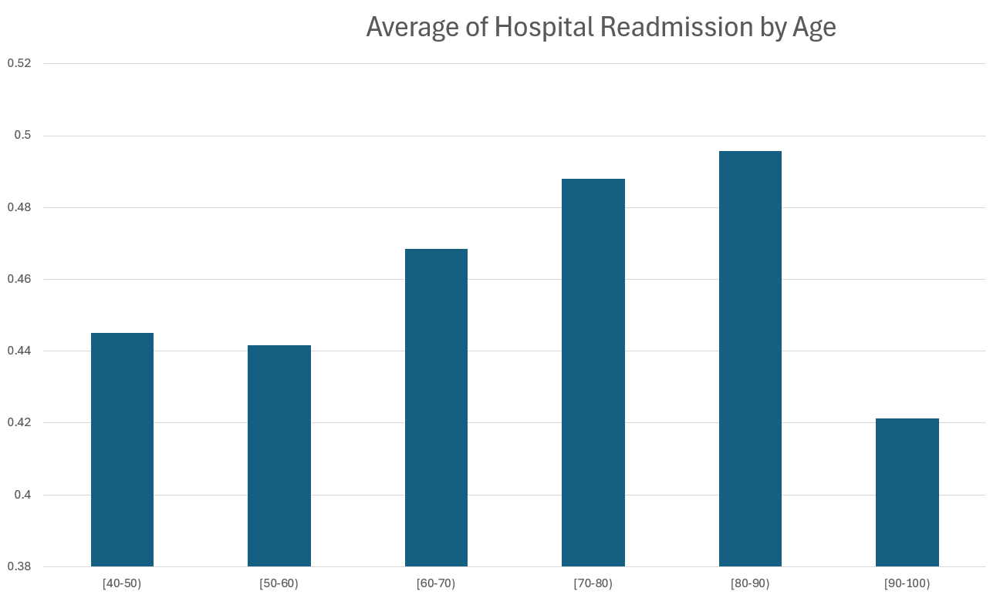
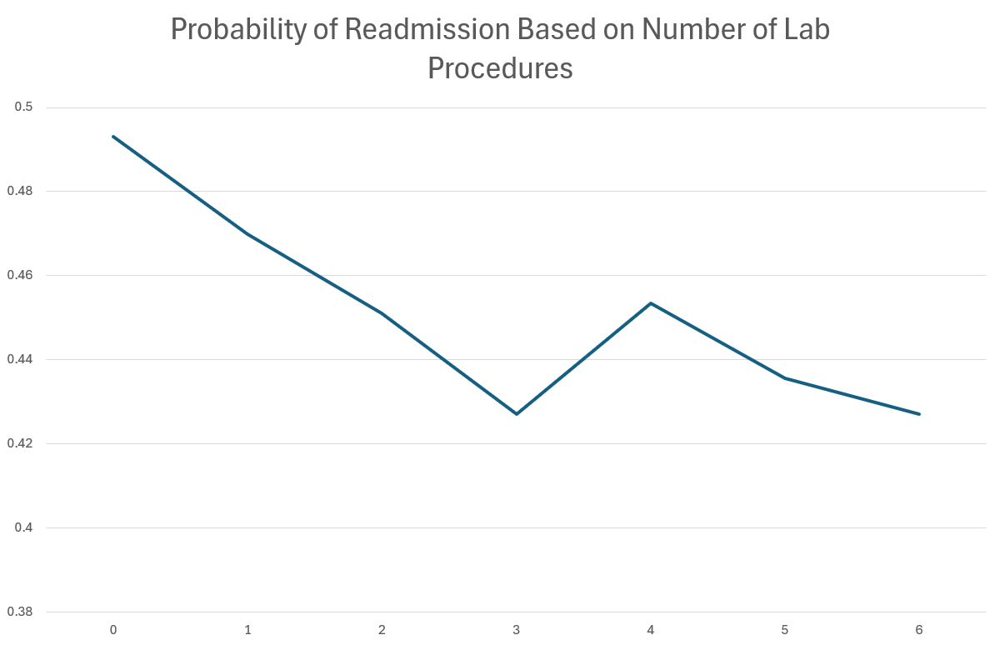
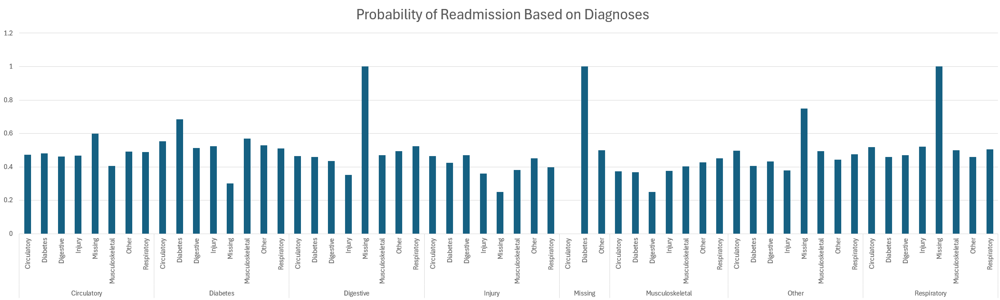

## Overview

In this analysis, we explore Kaggle's hospital readmission data to identify the key factors predicting patient readmission. The dataset includes the following columns: `age`, `time_in_hospital`, `n_lab_procedures`, `n_procedures`, `n_medications`, `n_outpatient`, `n_inpatient`, `n_emergency`, `medical_specialty`, `diag_1`, `diag_2`, `diag_3`, `glucose_test`, `A1Ctest`, `change`, `diabetes_med`, and `readmitted`. Our goal is to determine which variables are most indicative of a patient being readmitted to the hospital.

Data found at:
https://www.kaggle.com/datasets/dubradave/hospital-readmissions

## Methodology

### Exploratory Data Analysis

We conducted an Exploratory Data Analysis (EDA) to understand the dataset's structure and characteristics. Categorical data was analyzed by examining frequency distributions and relationships between categories, while numerical data was normalized and compared to readmission variables. This approach allowed us to assess how different features relate to readmission and to identify patterns and anomalies.

### Visualization

We created various visualizations to provide a clearer understanding of the data and the factors influencing readmission. By plotting different features against the readmission variable, we gained insights into which aspects of the data are most relevant to predicting patient outcomes.

## Key Findings

Our analysis revealed that the most significant factors affecting readmission include `age`, `n_lab_procedures`, and the categorical diagnoses of diabetes observed on multiple occasions. We used averaging and normalization techniques to ensure that the data was comparable across different scales and distributions.

## Visualizations

This bar chart illustrates the average probability of hospital readmission across different age groups. The analysis reveals that the likelihood of readmission generally increases with age, peaking in the `[80-90]` age group. Patients within the `[70-80]` and `[80-90]` age brackets show the highest average readmission probabilities, indicating a stronger likelihood of readmission among older patients. Interestingly, the `[90-100]` age group exhibits a lower readmission probability, which may be influenced by factors such as a smaller sample size or distinct medical considerations. This visualization underscores the significance of age as a key factor in predicting hospital readmission, providing valuable insights for developing targeted healthcare strategies to reduce readmission rates among older populations.

This line chart shows the probability of hospital readmission in relation to the number of lab procedures performed. The x-axis represents the number of lab procedures, while the y-axis indicates the probability of readmission. The chart reveals a general downward trend, suggesting that an increased number of lab procedures is associated with a lower probability of readmission. There is a slight increase in readmission probability at 4 lab procedures, followed by a continued decline. This visualization highlights the potential impact of thorough medical monitoring, as more lab procedures may contribute to better patient outcomes and reduced likelihood of readmission.

This bar chart shoes the probability of readmission based on categorical diagnoses. The upper, vertical description represents the first diagnosis, while the lower is the second. The 'missing' diagnosis gives certainty to the patient's return, so we ignore this data. The highest among the useful data is diabetes twice, which means that if a patient is given the primary reason of visiting 'diabetes' on two occasions, there is a higher probability of return compared to any other diagnosis.    

## Conclusion

Our analysis highlights that certain data columns are particularly useful in predicting hospital readmission. By focusing on factors such as age, laboratory procedures, and diabetes diagnoses, we can better understand and anticipate patient readmission risks. This insight is crucial for improving hospital resource management and patient care strategies.

